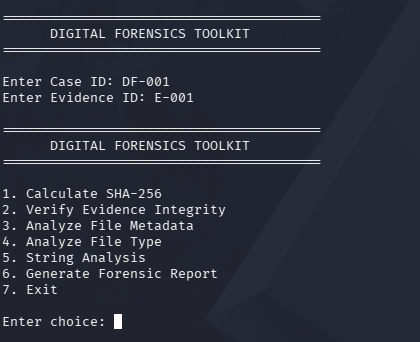
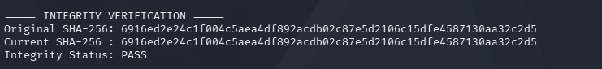
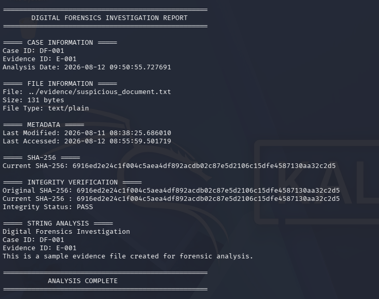

# Digital Forensics Investigation & Evidence Integrity Toolkit

## Overview

A Python-based digital forensics toolkit developed in Kali Linux for analyzing digital evidence, verifying evidence integrity, extracting file metadata, performing string analysis, and generating automated forensic investigation reports.

The toolkit provides an interactive command-line interface that allows investigators to perform multiple evidence analysis tasks from a single program.

## Objectives

- Calculate SHA-256 hashes of digital evidence
- Verify evidence integrity
- Detect modifications to evidence files
- Extract file metadata
- Identify file types
- Perform basic string analysis
- Generate automated forensic reports
- Organize investigations using Case ID and Evidence ID
- Handle invalid input safely

## Features

### 1. Interactive Menu

The toolkit provides a simple interactive menu:

```text
1. Calculate SHA-256
2. Verify Evidence Integrity
3. Analyze File Metadata
4. Analyze File Type
5. String Analysis
6. Generate Forensic Report
7. Exit
```

### 2. SHA-256 Hashing

Calculates the SHA-256 hash of an evidence file to create a unique digital fingerprint.

Example:

```text
SHA-256:
6916ed2e24c1f004c5aea4df892acdb02c87e5d2106c15dfe4587130aa32c2d5
```

### 3. Evidence Integrity Verification

The toolkit compares the original SHA-256 hash of an evidence file with its current SHA-256 hash.

```text
Matching hashes  → PASS
Different hashes → FAILED
```

This allows the investigator to identify whether an evidence file has been modified.

### 4. Metadata Analysis

The toolkit extracts basic forensic metadata including:

- File size
- File type
- Last modified time
- Last accessed time

### 5. File Analysis

The toolkit identifies basic file information such as:

- File name
- File size
- MIME type

### 6. String Analysis

The toolkit extracts readable strings from evidence files to help identify potentially useful forensic information.

### 7. Case Management

Each investigation can be identified using:

- Case ID
- Evidence ID
- Analysis timestamp

Example:

```text
Case ID: DF-001
Evidence ID: E-001
```

### 8. Automated Forensic Reporting

The toolkit generates a forensic investigation report containing:

- Case information
- Evidence information
- File information
- Metadata
- SHA-256 hash
- Integrity verification result
- String analysis
- Analysis timestamp

The report is saved as:

```text
reports/forensic_report.txt
```

### 9. Error Handling

The toolkit handles common errors such as:

- Invalid menu selections
- Missing evidence files
- Invalid file paths

## Project Structure

```text
DigitalForensicsToolkit/
│
├── evidence/
│   ├── suspicious_document.txt
│   ├── unchanged_copy.txt
│   └── altered_copy.txt
│
├── scripts/
│   ├── forensic_toolkit.py
│   ├── hash_checker.py
│   ├── metadata_analyzer.py
│   ├── file_analyzer.py
│   └── string_analyzer.py
│
├── reports/
│   └── forensic_report.txt
│
├── screenshots/
│   ├── 01_menu.png
│   ├── 02_integrity_pass.png
│   ├── 03_integrity_failed.png
│   └── 04_forensic_report.png
│
├── README.md
└── .gitignore
```

## Technologies Used

- Kali Linux
- Python 3
- SHA-256
- Linux command-line utilities
- Digital Forensics concepts

## Requirements

- Kali Linux or another Linux distribution
- Python 3

No external Python packages are required.

## Installation

Clone the repository:

```bash
git clone https://github.com/Lokeshd-25/DigitalForensicsToolkit.git
```

Enter the project directory:

```bash
cd DigitalForensicsToolkit
```

Go to the scripts directory:

```bash
cd scripts
```

## How to Run

Run the main forensic toolkit:

```bash
python3 forensic_toolkit.py
```

The program will ask for the investigation details:

```text
Enter Case ID: DF-001
Enter Evidence ID: E-001
```

The interactive menu will then appear:

```text
========================================
      DIGITAL FORENSICS TOOLKIT
========================================

1. Calculate SHA-256
2. Verify Evidence Integrity
3. Analyze File Metadata
4. Analyze File Type
5. String Analysis
6. Generate Forensic Report
7. Exit
```

## Example Evidence

The project contains sample evidence files:

```text
evidence/suspicious_document.txt
evidence/unchanged_copy.txt
evidence/altered_copy.txt
```

Example evidence path when running from the `scripts` directory:

```text
../evidence/suspicious_document.txt
```

## Example Workflow

### Step 1 — Start the Toolkit

```bash
python3 forensic_toolkit.py
```

### Step 2 — Enter Case Information

```text
Enter Case ID: DF-001
Enter Evidence ID: E-001
```

### Step 3 — Select an Analysis Option

For example:

```text
Enter choice: 1
```

### Step 4 — Provide the Evidence File

```text
Enter evidence file path:
../evidence/suspicious_document.txt
```

### Step 5 — Calculate SHA-256

The toolkit produces the evidence hash:

```text
===== SHA-256 HASH =====
6916ed2e24c1f004c5aea4df892acdb02c87e5d2106c15dfe4587130aa32c2d5
```

## Integrity Verification

Integrity verification is the main security feature of the project.

### Original Evidence

The original evidence file produced:

```text
6916ed2e24c1f004c5aea4df892acdb02c87e5d2106c15dfe4587130aa32c2d5
```

When the current hash matches the original hash:

```text
===== INTEGRITY VERIFICATION =====
Original SHA-256: 6916ed2e24c1f004c5aea4df892acdb02c87e5d2106c15dfe4587130aa32c2d5
Current SHA-256 : 6916ed2e24c1f004c5aea4df892acdb02c87e5d2106c15dfe4587130aa32c2d5
Integrity Status: PASS
```

### Altered Evidence

The altered evidence produced:

```text
32c64d0138929eba9747106441f5e8c5dcae5efb8eb8bf91c9994bbc04f1c814
```

When compared with the original evidence hash:

```text
===== INTEGRITY VERIFICATION =====
Original SHA-256: 6916ed2e24c1f004c5aea4df892acdb02c87e5d2106c15dfe4587130aa32c2d5
Current SHA-256 : 32c64d0138929eba9747106441f5e8c5dcae5efb8eb8bf91c9994bbc04f1c814
Integrity Status: FAILED
```

This demonstrates that the toolkit can detect modification of digital evidence.

## Forensic Report

The toolkit automatically generates a report at:

```text
reports/forensic_report.txt
```

The report contains:

```text
DIGITAL FORENSICS INVESTIGATION REPORT

CASE INFORMATION
FILE INFORMATION
METADATA
SHA-256
INTEGRITY VERIFICATION
STRING ANALYSIS
ANALYSIS COMPLETE
```

The report also records the Case ID, Evidence ID, and analysis timestamp.

## Test Results

| Test | Result |
|---|---|
| Interactive menu | PASS |
| Case ID handling | PASS |
| Evidence ID handling | PASS |
| SHA-256 calculation | PASS |
| Original evidence integrity | PASS |
| Unchanged copy verification | PASS |
| Altered evidence detection | PASS |
| Metadata analysis | PASS |
| File type analysis | PASS |
| String analysis | PASS |
| Automated report generation | PASS |
| Missing file handling | PASS |
| Invalid menu handling | PASS |

## Screenshots

### Interactive Menu



### Integrity Verification - PASS



### Integrity Verification - FAILED


### Forensic Investigation Report



## Security and Forensic Relevance

Hash-based integrity verification is useful in digital forensics because investigators need to determine whether evidence has remained unchanged during analysis.

SHA-256 provides a cryptographic fingerprint that can be compared before and after evidence handling.

The project demonstrates the basic workflow of:

```text
Digital Evidence
       ↓
SHA-256 Hash
       ↓
Evidence Analysis
       ↓
Hash Comparison
       ↓
PASS / FAILED
       ↓
Forensic Report
```

## Limitations

This project is an educational digital forensics toolkit and is not intended to replace professional forensic investigation software.

The current version performs basic file-level analysis and does not provide complete forensic disk imaging, advanced filesystem analysis, or professional chain-of-custody management.

## Future Improvements

- Multiple evidence file analysis
- Advanced metadata extraction
- Additional hash algorithms such as SHA-512
- PDF and HTML report generation
- Evidence timeline visualization
- Graphical user interface
- Case management database
- Evidence chain-of-custody tracking
- Disk image analysis
- Advanced file carving
- Automated suspicious string detection

## Author

Lokesh

## Disclaimer

This project is intended for educational purposes and authorized forensic analysis only.
